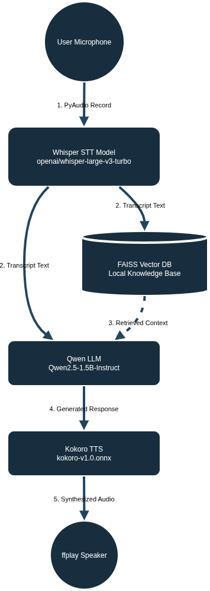

# Custom Voice Agent

A custom voice-to-voice agent that listens to your queries, retrieves relevant information using RAG, generates a response using a local LLM, and speaks it back to you.

## Features
- **Speech-to-Text (STT):** `openai/whisper-large-v3-turbo`
- **Knowledge Base (RAG):** `sentence-transformers/all-MiniLM-L6-v2` with FAISS
- **Large Language Model (LLM):** `Qwen/Qwen2.5-1.5B-Instruct`
- **Text-to-Speech (TTS):** Kokoro ONNX

## Architecture & Flow



The agent operates in a continuous loop executing the following steps for each interaction:
1. **User Audio:** PyAudio records your query from the microphone.
2. **Transcription (STT):** The Whisper model transcribes the recorded audio into text.
3. **Context Retrieval (RAG):** The transcript is used to search the local FAISS vector database for relevant knowledge.
4. **Response Generation (LLM):** The Qwen model uses the retrieved context and user query to generate a concise text response.
5. **Synthesis (TTS):** Kokoro ONNX synthesizes the generated response into high-quality audio.
6. **Playback:** The resulting audio file is played back to you using `ffplay`.

## Prerequisites

Before running the application, you need to install system dependencies for audio recording and playback:
- **ffmpeg** (for `ffplay` used in audio playback)
- **portaudio** (for `pyaudio` used in microphone recording)

### Linux (Ubuntu/Debian)
```bash
sudo apt-get install ffmpeg portaudio19-dev python3-pyaudio
```

### macOS
```bash
brew install ffmpeg portaudio
```

## Setup

1. **Install Python dependencies using uv:**
Since the project uses a `uv.lock` file, you can install everything lightning-fast with:
```bash
uv sync
```

2. **Download Kokoro Models:**
Ensure that you download the Kokoro-ONNX models to the root directory of the project.

# Updated 2026 Download Links
```bash
!wget https://github.com/thewh1teagle/kokoro-onnx/releases/download/model-files-v1.0/kokoro-v1.0.onnx
!wget https://github.com/thewh1teagle/kokoro-onnx/releases/download/model-files-v1.0/voices-v1.0.bin
```

## Running the Agent

Start the agent by running the main Python script:

```bash
python main.py
```

Follow the on-screen prompts:
- Press `Enter` to start recording.
- Speak your query (recording lasts for 5 seconds by default).
- Wait for the AI to process the speech, search its knowledge base, generate a response, and play it back as audio.
- Press `Ctrl+C` to exit cleanly.

## Customizing the Knowledge Base

You can modify the data fed into the FAISS vector database inside `core/knowledge.py` to allow the agent to answer questions about your custom documents.
